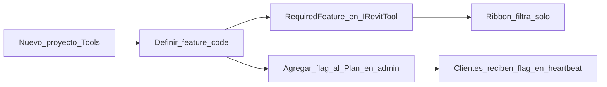
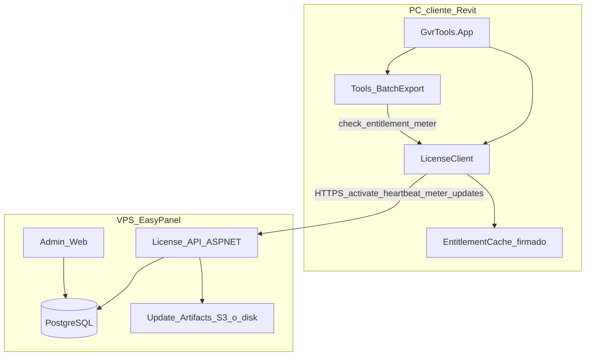
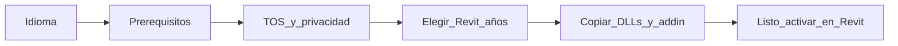

# Plan: Licencias, planes y actualizaciones para GVR Tools

Sistema de licencias **self-hosted** en VPS (EasyPanel): panel admin para activar planes/cuotas a mano, distribución profesional tipo DiRoots/ProSheets (instalador `.exe`), add-in Revit multi-versión con prerequisitos (PDF en 2021), validación en línea con gracia offline corta, actualizaciones firmadas y endurecimiento anti-abuso realista.

## Realidad del producto (importante)

### Qué es el producto vs qué entregas al cliente

| Capa | Qué es | Notas |
| --- | --- | --- |
| Producto real | **Add-in de Revit** (DLL + `.addin`) | Corre **dentro** del proceso de Revit; la API cambia por año |
| Entrega comercial | **Instalador `.exe`** (como ProSheets) | Wizard: idioma → prerequisitos → versiones de Revit → instalar |
| Motor de negocio | **License API** en tu VPS | Planes, cuotas, suspensión, updates |

Hoy el desarrollo usa [`scripts/install-addin.ps1`](../scripts/install-addin.ps1). En producción el cliente **no** corre ese script: recibe un `.exe` firmado que empaqueta lo mismo (builds por año + manifiestos), al estilo DiRoots.

La exportación PDF/DWG **sigue en el PC del cliente**: usa la API de Revit en proceso ([`ARCHITECTURE.md`](ARCHITECTURE.md)). El `.exe` **no** es la herramienta; es el vehículo de instalación.

**Qué sí va al backend (tu control real):**

- validez de licencia / plan / fecha de vencimiento
- qué tools y qué límites tiene el plan (ej. N exportaciones/mes, N láminas/lote)
- consumo de cuotas y telemetría de uso
- emisión de actualizaciones y quién puede bajarlas
- alta/baja/suspensión de clientes desde tu panel

**Qué no se puede “meter en SaaS” sin romper el producto:** motores Revit en [`GvrTools.Revit`](../src/GvrTools.Revit). Moverlos al servidor no evita cracks y sí rompe el flujo.

**Anti-crack honesto:** un DLL .NET en el cliente **siempre se puede parchear**. El objetivo de producción no es “imposible”, sino **caro de mantener crackeado** + que el crack pierda valor (cuotas/planes/updates viven en tu servidor). Con gracia offline corta ganas mucho control.

### Por qué la API de Revit obliga a varios binarios

Autodesk publica una API distinta por año. Un solo código fuente (como ya tienes) se compila a **un set de DLLs por versión**:

- Revit 2021–2024 → `net48`
- Revit 2025+ → `net8.0-windows`

Salida actual: `build/2021/`, `build/2022/`, … (ver [`ARCHITECTURE.md`](ARCHITECTURE.md)). El instalador empaqueta **todas** esas carpetas y solo escribe el `.addin` de las versiones que el usuario marque (y que existan en el PC).

### Caso especial Revit 2021 + PDF (igual que ProSheets + PDF24)

Desde Revit **2022** existe `Document.Export` + `PDFExportOptions` (PDF nativo, sin impresora). En **2021** no: hay que plotear con una impresora PDF de Windows que acepte ruta silenciosa (PDF24, Bullzip, Adobe Distiller, etc.). “Microsoft Print to PDF” **no sirve** (pregunta en cada lámina).

Referencia de mercado (ProSheets v2.x): el wizard detecta prerequisitos (p. ej. **PDF24 Creator**) y los marca como *Must install* antes del add-in. GVR debe hacer lo mismo cuando el usuario elige Revit 2021 (o cuando el instalador detecta 2021 instalado).

### Decisiones fijadas

- Validación **online** + gracia offline **7 días** (heartbeat diario cuando hay red).
- Cobro **manual** (transferencia/factura): tú activas/renuevas en el panel admin. Sin Stripe en v1. El precio acordado se anota en `Customer` / notas de pago; no vive en el add-in.
- Distribución comercial = **instalador `.exe`** multi-versión + prerequisitos (no solo el script de desarrollo).
- **Un producto = GVR Tools** (cinta con N tools). Se vende por **plan**, no un instalador por tool. Tools nuevas se habilitan por feature flag en el servidor.
- Metering v1 = **láminas exportadas con éxito / mes calendario** (UTC). Un lote PDF+DWG de 10 láminas cuenta **20**.
- Formatos PDF / DWG / PDF+DWG y opciones de la ventana BatchExport van en el plan vía features (no hardcode en el cliente).
- Licencias **node-locked** (fingerprint de PC), no floating. Un seat = un dispositivo.
- Telemetría v1 = solo eventos de **uso/cuota** necesarios para metering. Sin crash reports ni analytics de UI.
- Sin portal self-service del cliente en v1: solo panel admin del dueño.
- UI de licencia del add-in en **español** (v1); el instalador ofrece ES/EN.
- Soporte al cliente: correo único mostrado en la ventana “Cuenta / Licencia” y en el FAQ (configurable en admin como `support_email`).
- Textos legales: páginas TOS y Privacy hospedadas en tu dominio; el installer solo enlaza y exige checkbox de aceptación (obligatorio antes del primer cliente de pago).
- License key: formato `GVR-XXXX-XXXX-XXXX` (alfanumérico, checksum en el servidor al emitir). El cliente envía la key tal cual en `/v1/activate`. Generación: `RandomNumberGenerator.GetBytes` (crypto-seguro) → codificar en **Base32 Crockford** (excluye `I/O/0/1`, sin ambigüedad al dictarla por teléfono/soporte) → agrupar en bloques de 4 → añadir un checksum corto (CRC16 o mod-97) sobre el payload, para que el servidor rechace typos sin tocar la base de datos. Se guarda tal cual en Postgres (no es una contraseña; el control real vive en `status`/`valid_until`), así soporte la puede buscar fácil cuando el cliente la manda por correo.
- Reloj del PC: `offline_until` es instante absoluto firmado por el servidor; sin heartbeat válido no se extiende la gracia (no se confía en la fecha local para renovar).
- Revit 2026+: al soportar un año nuevo → props + `build/<año>` + checkbox en el installer + release multi-año.
- Entrega de la key: **manual**. Tú copias la key desde el admin y la envías por tu propio correo/WhatsApp al cliente. Sin SMTP ni envío automático en v1 (ni de bienvenida, ni de aviso de vencimiento) — el aviso previo a suspender también es manual.
---

## Cobertura del producto actual vs plan

Hoy el repo solo tiene **una tool de producto**: Batch Export ([`GvrTools.Tools.BatchExport`](../src/GvrTools.Tools.BatchExport), id `GvrBatchExport`). El resto es infraestructura (Core, UI, Revit, App).

| Capacidad actual en el add-in | ¿Cubierta por el plan de licencias? | Cómo se modela |
| --- | --- | --- |
| Cinta GVR Tools + descubrimiento de tools | Sí | Ribbon filtra por entitlements |
| Exportación masiva PDF | Sí | Feature `tool.batch_export` + opcional `format.pdf` |
| Exportación masiva DWG | Sí | Feature `format.dwg` (puede ir en Starter o solo Pro) |
| Modo PDF + DWG en una pasada | Sí | Feature `format.pdf_dwg` o ambas `format.*` |
| Filtro por set de láminas / buscador | Incluida con la tool | No se cobra aparte en v1 |
| Opciones PDF (tamaño, margen, color, calidad) | Incluidas con `format.pdf` | Sub-features solo si más adelante quieres freemium fino |
| Opciones DWG (versión ACAD, merge, coords, PNG) | Incluidas con `format.dwg` | Idem; `format.dwg_image` si quieres separar el PNG |
| Progreso / cancelar / log / preferencias locales | Infra, no se licencia | Siempre disponibles si la tool está on |
| Multi-Revit 2021–2025 | Instalador + builds | Una seat = todos los años en ese PC |
| Prerequisito PDF24 en 2021 | Instalador | Fuera del license server |
| Tools futuras (`GvrTools.Tools.*`) | Previsto | Nuevo feature code + fila en Plan; ver sección extensibilidad |

**Conclusión:** el plan de negocio/arquitectura **sí contempla** lo que existe hoy, pero a nivel de **catálogo comercial** hay que fijar el mapa feature ↔ plan (tabla más abajo). Sin eso el servidor no sabe qué vender.

---

## Catálogo de features (contrato estable)

Códigos **estables para siempre** (como `IRevitTool.Id`). El add-in solo pregunta por strings; el admin edita qué plan los incluye.

### Features v1 (producto actual)

| Feature code | Significa | Gate en cliente |
| --- | --- | --- |
| `tool.batch_export` | Muestra botón Batch Export | Ribbon + comando |
| `format.pdf` | Puede elegir PDF | UI FormatMode |
| `format.dwg` | Puede elegir DWG | UI FormatMode |
| `format.pdf_dwg` | Puede elegir PDF+DWG | UI FormatMode |
| `quota.sheets_per_month` | Límite numérico (entero; `-1` = ilimitado) | Antes de iniciar lote + al contabilizar |
| `limit.sheets_per_batch` | Máx. láminas seleccionadas por corrida | Al pulsar Exportar |
| `seat.max_devices` | PCs por licencia | Activate |
| `updates.stable` | Puede recibir updates | Update check |

### Features reservadas (tools futuras — no implementar aún)

Ejemplos de naming; se crean cuando exista el proyecto `GvrTools.Tools.*`:

| Feature code (ejemplo) | Uso futuro |
| --- | --- |
| `tool.*` | Un code por tool (`tool.print_set`, `tool.rename_sheets`, …) |
| `quota.<tool>_runs_per_month` | Si esa tool se mide por “usos”, no por láminas |
| `limit.<tool>_…` | Topes específicos de esa tool |
| `addon.*` | Extras de plan (soporte prioritario no se gatea en código) |

Regla: **toda tool nueva declara su `RequiredFeature` en el `IRevitTool`** (o atributo/metadata). Si el plan no la tiene, no aparece en la cinta. No hace falta recompilar el license server para “conocer” la tool: basta añadir el string al JSON del Plan en admin.

### Planes v1 propuestos (editables en admin)

| Feature | Trial (14 días) | Starter | Pro |
| --- | --- | --- | --- |
| `tool.batch_export` | sí | sí | sí |
| `format.pdf` | sí | sí | sí |
| `format.dwg` | sí | no | sí |
| `format.pdf_dwg` | sí | no | sí |
| `quota.sheets_per_month` | 100 | 500 | -1 |
| `limit.sheets_per_batch` | 30 | 100 | 500 |
| `seat.max_devices` | 1 | 1 | 3 |
| `updates.stable` | sí | sí | sí |

Trial = licencia con `valid_until` corto que tú emites a mano (mismo flujo que pago).

### Reglas de consumo (Batch Export) — definidas

1. Unidad: **lámina exportada con éxito** (`BatchItemResult` OK). Fallos no consumen.
2. PDF+DWG: cada formato cuenta → 10 láminas × 2 = **20** contra la cuota mensual.
3. Si al iniciar el lote `seleccionadas > restante`, **bloquear** con mensaje (“Te quedan N láminas este mes”) — no empezar a medias.
4. Si `seleccionadas > limit.sheets_per_batch`, bloquear antes de exportar.
5. Período: **mes calendario UTC**; al día 1 se resetea el contador en servidor (el heartbeat trae el nuevo remaining).
6. Offline: el blob cacheado lleva `remaining`; el cliente **no incrementa por encima** de ese remaining; al volver online, `POST /v1/usage` reconcilia (eventos idempotentes). Si el servidor tiene menos remaining (otra máquina gastó), el próximo heartbeat corrige.

### Dónde vive la lógica: app (EF Core) vs Postgres (función/trigger)

Regla: si una operación necesita ser **atómica bajo concurrencia**, o debe quedar **garantizada pase lo que pase** en la capa de aplicación (no depender de que el código se acuerde de hacerla), va como función o trigger en Postgres. Todo lo demás — CRUD, altas, ediciones desde el admin — se queda en EF Core normal. No se empuja todo a la base de datos, solo lo que EF Core no puede garantizar por sí mismo.

Casos concretos v1:

| Caso | Mecanismo | Por qué en Postgres y no en C# |
| --- | --- | --- |
| Consumo de cuota (`quota.sheets_per_month`) | Función `consume_quota(license_id, feature, amount)` — `UPDATE ... RETURNING` atómico | Evita condición de carrera entre dos reportes de uso casi simultáneos (dos devices del mismo seat, o un reintento de red) sin locks explícitos en C# |
| Idempotencia de `UsageEvent` (`event_id`) | Constraint único + `ON CONFLICT DO NOTHING` | Reintentos de red del cliente offline no deben duplicar consumo; más simple y más seguro que "buscar si existe" antes de insertar |
| Auditoría de cambios de `License.status` | Trigger `AFTER UPDATE` que inserta en `AuditLog` | Garantiza el rastro aunque alguien edite directo en `psql` o un endpoint futuro olvide llamar al audit manualmente |
| Reset mensual de cuota | Ninguno — `UsageCounter` ya está particionado por `period` (mes UTC) | Un mes nuevo simplemente no tiene fila todavía; no hace falta job de reset ni trigger |
| Checksum de license key al activar | C# (no Postgres) | Es validación de formato sin estado ni concurrencia; forzarlo a la BD movería lógica sin ganar nada |

---

## Extensibilidad: cómo sumar una tool nueva al negocio

Flujo alineado con [`ARCHITECTURE.md`](ARCHITECTURE.md) (crear proyecto `GvrTools.Tools.*` sin tocar el host):



Checklist por tool nueva:

1. Elegir `feature` estable (`tool.mi_herramienta`).
2. Implementar tool + `RequiredFeature` / chequeo `CanUse` al abrir comando.
3. Decidir métrica: ¿láminas, corridas, GB, sin cuota?
4. En admin: marcar el feature en Starter/Pro/Trial (sin redeploy del API si el plan es JSON flexible).
5. Si necesita prerequisito de OS (como PDF24): fila nueva en el wizard del `.exe`, condicionada al año Revit o a la tool.
6. Documentar en FAQ y, si cambia el instalador, bump de versión del `.exe`.

El license server **no** lista tools hardcodeadas: solo almacena un diccionario `features: { "tool.x": true, "quota.y": 500 }`. Así el crecimiento del producto no rediseña el SaaS.

---

## Arquitectura objetivo



---

## Pieza 1 — Backend de licencias (EasyPanel)

Stack recomendado (simple, tuyo, control total):

- **API** ASP.NET Core (.NET 8/10 LTS, C#, mismo ecosistema que el add-in)
- **Admin**: **mismo proyecto ASP.NET Core** que la API, no un servicio aparte. Sirve `/v1/*` (API, auth por API key/JWT) y `/admin/*` (panel, auth por cookie + TOTP) desde un solo contenedor — un `DbContext`, un release, menos piezas que mantener en EasyPanel. UI del panel con **Razor Pages/MVC** (server-rendered, sin build pipeline): es un panel de uso ocasional y solo tuyo, así que evita Blazor Server — depende de un WebSocket persistente contra Traefik, complejidad que no aporta nada aquí. 2FA con **Otp.NET** (NuGet, solo lado servidor).
- **EF Core + Npgsql** contra PostgreSQL (migraciones + productividad para ~8 entidades del modelo de datos).
- **`Microsoft.AspNetCore.RateLimiting`** (nativo desde .NET 7, sin NuGet extra) para el rate limit de activate/heartbeat de la Pieza 3.
- **System.Text.Json** en todo, simétrico con el cliente.
- Reverse proxy HTTPS (Traefik/Caddy que ya use EasyPanel)
- Dominio tipo `license.tudominio.com`

### Modelo de datos (núcleo)

- `Customer` — empresa, contacto, notas de pago
- `Plan` — código (`starter`, `pro`, …), features JSON, límites
- `License` — key (`GVR-XXXX-XXXX-XXXX`), customer, plan, status (`active`/`suspended`/`expired`), `valid_until`, max seats/machines
- `Seat` / `Device` — machine fingerprint, última vista, nombre PC (node-locked; no floating)
- `Entitlement` — derivado del plan (feature flags + quotas)
- `UsageEvent` / `UsageCounter` — contadores por **mes calendario UTC** (solo metering de cuotas)
- `Release` — versión, canal (`stable`), checksum, URL, notas, firma
- `AuditLog` — quién activó/renovó/suspendió
- `AppSettings` — `support_email`, URLs de TOS/Privacy
- `AdminUser` — usuario + hash de contraseña de quien entra al panel (Pieza 5); no floating, no config
### Planes y límites

Ver **Catálogo de features** y tabla Trial / Starter / Pro más arriba. Los números viven en Postgres (JSON del `Plan`); el add-in no hardcodea topes.

Cada tool del catálogo (`IRevitTool.Id`) se mapea a un feature code estable (`tool.batch_export`). Al arrancar, el ribbon solo muestra tools con entitlement.

### API mínima (v1)

- `POST /v1/activate` — license key + machine fingerprint → JWT (`AccessToken`, ES256, 14 días) + entitlements firmados
- `POST /v1/heartbeat` — requiere `Authorization: Bearer {AccessToken}`; renueva gracia, refresca entitlements/cuotas
- `POST /v1/usage` — requiere `Authorization: Bearer {AccessToken}`; reporta consumos (idempotente por `event_id`)
- `GET /v1/updates/check?version=&revit=` — última release permitida
- `GET /v1/updates/download/{id}` — URL firmada temporal
- Admin (sesión dueño): CRUD customers/plans/licenses, suspender, renovar `valid_until`, ver uso y devices, forzar logout de seat

### Tokens y gracia offline

- Al activar/heartbeat el servidor firma un **blob de entitlements** con: license id, plan, features, quotas restantes, `issued_at`, `offline_until` (= now + 7 días), device id.
- Algoritmo: **ECDsa P-256**, no Ed25519. El add-in (`net48` en 2021–2024) tiene que **verificar** esa firma, y Ed25519 no es nativo en .NET Framework 4.8 — obligaría a meter una librería de terceros (NSec, BouncyCastle) justo en la capa que el proyecto evita a propósito por DLL hell (ver [`ARCHITECTURE.md`](ARCHITECTURE.md)). `ECDsa` está en `System.Security.Cryptography` tanto en `net48` como en `net8.0-windows` — cero NuGet en el cliente, y firma pequeña (~64–72 bytes) suficiente para embeber en el blob JSON.
- El add-in verifica firma con **clave pública embebida** (rota vía update).
- Sin red: si `now < offline_until` y la firma es válida → funciona con cuotas cacheadas (conservadoras).
- Pasados 7 días sin heartbeat → tools bloqueadas con mensaje claro (“conectar para renovar licencia”).
- Heartbeat diario cuando hay internet; si la licencia fue suspendida en admin → bloqueo en el próximo heartbeat (máx. ~24h; en gracia peor caso 7 días — aceptable para cobro manual B2B).

### Sesión del add-in: JWT, no un token casero

`/v1/activate` además devuelve un **JWT (ES256)** como `AccessToken` -- distinto del blob de
entitlements de arriba, aunque firmado con la misma clave ECDsa P-256. El add-in lo manda como
`Authorization: Bearer {AccessToken}` en `/v1/heartbeat` y `/v1/usage`; el servidor lo valida con
el middleware estándar de ASP.NET Core (`AddJwtBearer`), no con código de validación a mano.
Claims: `license_id`, `device_id`, `iss`/`aud` fijos, `exp` a 14 días. Sin tabla de sesiones: el
JWT es autocontenido y se revoca de facto en el próximo heartbeat si la licencia se suspende (el
token sigue siendo válido criptográficamente, pero `LicenseEngine` corta con 403 al ver
`status != active`).

### Huella de máquina

- Hash estable de: MachineGuid + volumen sistema + user SID (no enviar PII cruda).
- Bind al seat; si supera `max_devices`, admin debe liberar un puesto (flujo “desactivar este PC” en UI del add-in + botón en admin).

---

## Pieza 2 — Cliente en el add-in

Nuevo proyecto: `GvrTools.Licensing` (referencia desde `GvrTools.App` y tools).

Responsabilidades:

- Activación (ventana WPF: pegar key `GVR-…`)
- Persistencia local del blob firmado + device id en `%APPDATA%\GVR\GvrTools\license.dat`
- Heartbeat en `OnStartup` (async, no bloquear Revit >2–3s; si falla red, usar cache)
- `IEntitlementService.CanUse(feature)` / `Consume(feature, quantity)` antes de correr un job
- Gate en ribbon: tras `ToolCatalog.Discover`, filtrar por features
- Gate en comando: p.ej. al iniciar lote en BatchExport, reservar/consumir cuota
- Botón **Desactivar este PC** (libera seat en servidor + borra `license.dat` local)

Integración concreta:

- `GvrApplication.OnStartup` → init license + filtrar tools
- `BatchExportCommand` / ViewModel → chequeo de cuota antes de `BeginSession`
- UI: ventana “Cuenta / Licencia” (plan, vencimiento, remaining, `support_email`, desactivar PC)

HTTP: usar `HttpClient` + `System.Text.Json` con cuidado de binding (cargar en contexto del add-in; evitar dependencias NuGet pesadas que choquen con Revit — alineado con la nota de [`ARCHITECTURE.md`](ARCHITECTURE.md) sobre JSON/DLL hell). Preferir APIs built-in de .NET.

---

## Pieza 3 — Seguridad anti-abuso (capa realista)

Orden de impacto (de más a menos útil):

1. **Servidor manda** — features/cuotas/fechas solo en blob firmado; crack local sin servidor no renueva ni recibe updates.
2. **Firma asimétrica** — clave privada solo en VPS; pública en cliente.
3. **Heartbeat + suspensión** — puedes apagar un crack masivo invalidando keys.
4. **Obfuscación** (ConfuserEx / .NET Reactor en Release) del ensamblado `Licensing` y gates — sube costo de patch; no es la defensa principal.
5. **Integrity check ligero** — hash de DLLs propias al arrancar (detección básica; un crack serio lo quita).
6. **No secretos en el cliente** — nunca API keys privadas, nunca `if license == true` fácil sin verificar firma.
7. **Rate limit + auditoría** en API (activaciones, heartbeats anómalos, muchos devices).

No invertir en VM protectors caros ni en “server-side PDF”: no aportan ROI en un add-in Revit.

---

## Pieza 4 — Actualizaciones

Flujo:

1. Tú subes build `build/2021`…`build/2025` + checksums al servidor (o storage del VPS).
2. Firmas el manifiesto de release con la misma clave de licensing.
3. Add-in: `GET /v1/updates/check` en startup (throttled).
4. Si hay update: aviso no modal → “Descargar e instalar” → script/helper que copie DLLs a la carpeta del add-in y pida reiniciar Revit (basado en la lógica actual de [`install-addin.ps1`](../scripts/install-addin.ps1)).
5. Solo licenses `active` descargan.

Canal único `stable` en v1. Versionado semver en `AssemblyInformationalVersion`.

---

## Pieza 5 — Panel dueño (control total)

Pantallas mínimas:

- Dashboard: licenses activas, uso del mes, por vencer
- Clientes + notas de pago
- Crear/renovar licencia (elige plan, `valid_until`, max devices)
- Suspender / reactivar
- Ver devices y “kick seat”
- Planes: editar features/límites sin recompilar el add-in
- Releases: subir artefactos + publicar
- Audit log
- Administradores: alta de más usuarios admin

Auth admin: usuario/contraseña fuerte + sesión por cookie tokenizada. Sin 2FA en v1 -- se
evaluará más adelante si hace falta (decisión explícita: tokenizar la sesión ya es suficiente
para v1). Los admins viven en la tabla `AdminUser` de Postgres, no en configuración: soporta
varios administradores sin redeploy. El primero se siembra con
`server/tools/GenerateAdminBootstrap`; los siguientes se agregan desde `/Admin/Users/Create` ya
logueado.

---

## Pieza 6 — Deploy en EasyPanel

Servicios:

1. `gvr-license-api` (Docker, ASP.NET) — un solo contenedor que sirve **API** (`/v1/*`) y **Admin** (`/admin/*`); ver stack recomendado en Pieza 1
2. `postgres`
3. Volumen para artefactos de update (o MinIO en el mismo VPS)

Secrets: connection string, signing private key, admin bootstrap password — solo en EasyPanel env vars.

### Dominio

Subdominio de un dominio existente, p. ej. `license.tudominio.com`:

1. Crear el servicio `gvr-license-api` en EasyPanel → pestaña **Domains** → agregar `license.tudominio.com`.
2. En tu proveedor DNS: registro `A` (o `CNAME`) apuntando a la IP del VPS.
3. EasyPanel emite el certificado **Let's Encrypt** automático vía Traefik al detectar el dominio — no hace falta wildcard, un solo registro basta.

### Backups (externos, fuera del VPS)

- Usar el backup nativo de Postgres en EasyPanel (pestaña **Backups** del servicio) apuntando a almacenamiento **S3-compatible fuera del VPS** — Backblaze B2 o Cloudflare R2 (sin costo de egress, barato para volúmenes chicos). Si el backup vive en el mismo disco del VPS, un fallo de disco se lleva la DB y el backup juntos.
- Programar diario; retener al menos 7–14 días de historial (no solo el último, por si un error se detecta tarde).
- Los artefactos de update (`build/<año>` + instaladores) también deben quedar fuera del VPS — si usas un volumen local para eso, súmalo a la rutina de backup, o mejor, apunta directo a un bucket S3 desde el inicio para no duplicar mecanismos.
- Probar una restauración real al menos una vez; un backup que nunca se restauró no está probado.

### Monitoreo

- Endpoint `GET /health` en el API que valida conexión real a Postgres (no solo "el proceso responde").
- Monitor **externo** al VPS (para que un VPS caído no silencie su propia alerta): **UptimeRobot** (gratis, cada 5 min) o Better Uptime, pegándole a `/health` por HTTPS.
- Alerta por correo (y opcionalmente Telegram/WhatsApp) cuando caiga. Es crítico: si el API está caído, a los 7 días de gracia **todos** los clientes de pago quedan bloqueados.
- Restart policy de EasyPanel (auto-restart del contenedor) como primera línea de defensa ante crashes; el monitor externo cubre lo que el restart no detecta (ej. proceso vivo pero sin conexión a la DB).

---

## Pieza 7 — Empaque comercial tipo ProSheets (instalador `.exe`)

Referencia de UX: DiRoots ProSheets — wizard oscuro, idioma → prerequisitos → TOS → checkboxes por año de Revit → INSTALL.

### Flujo del wizard (v1 GVR Tools)



1. **Idioma** del instalador (ES/EN mínimo).
2. **Prerequisitos** (tabla Name / Required / Found / Action), estilo ProSheets:
   - Si el usuario va a instalar para **Revit 2021** (o el PC tiene 2021 y lo marca): exigir **PDF24 Creator** (o allow-list ya usada en código: Adobe PDF Distiller, Bullzip, etc.).
   - Si no está instalado → Action = *Must install* → el wizard lanza el setup embebido/descargado de PDF24 (o abre descarga oficial + re-detecta).
   - Para **solo 2022+**: prerequisito PDF **no obligatorio** (PDF nativo de Revit).
3. **Términos / privacidad** + checkbox “I agree” (bloquea INSTALL hasta aceptar).
4. **Install this Add-in for:** checkboxes **Revit 2021…2025** (y 2026+ cuando el código lo soporte).
   - Pre-marcar solo las versiones **detectadas** en `Program Files\Autodesk\Revit <año>\Revit.exe` (misma lógica que [`install-addin.ps1`](../scripts/install-addin.ps1)).
   - Permitir desmarcar; no instalar años sin Revit en el disco (aviso).
5. **INSTALL** → copia `build/<año>/*` a `%ProgramData%\GVR\GvrTools\<año>\` y escribe el `.addin` apuntando a `GvrTools.App.dll`.
6. Primer arranque de Revit → diálogo **Activar licencia** (key `GVR-…` emitida en el admin).
7. **Uninstall** (mismo `.exe` o entrada en Programas de Windows): elimina `.addin` de cada año instalado y la carpeta `%ProgramData%\GVR\GvrTools\`. No borra `%APPDATA%\GVR\…` logs/settings salvo opción “limpiar datos”. El seat en servidor **no** se libera solo: el usuario debe usar “Desactivar este PC” antes, o tú haces kick en admin.

### Layout en disco (producción)

```
%ProgramData%\GVR\GvrTools\
  2021\   GvrTools.App.dll + Tools.*.dll + ...
  2022\
  ...
  2025\
%APPDATA%\Autodesk\Revit\Addins\2025\GvrTools.addin  → apunta a ...\2025\GvrTools.App.dll
```

Una licencia / un seat cubre **todas** las versiones instaladas en ese PC (no una key por año). El metering es por uso de features, no por año de Revit.

### Updates vía el mismo canal

El update firmado del license server descarga un paquete multi-año (o solo los años instalados), reemplaza carpetas bajo `GvrTools\<año>\` y pide reiniciar Revit. El instalador `.exe` completo queda para instalación limpia y para quien no tiene la versión anterior.

### Firma de código (nivel profesional)

- Certificado Authenticode (EV o standard) en el `.exe` del instalador y, si aplica, en DLLs.
- Sin firma: Windows SmartScreen asusta a clientes BIM (parece malware). **Presupuesto obligatorio** antes de vender fuera del círculo interno.
- No distribuir PDB ni builds Debug.

### Herramienta de build del instalador

- **Inno Setup** o **Advanced Installer** (UI custom tipo ProSheets es más fácil con Advanced Installer / installer UI propio; Inno + wizard custom también sirve).
- Pipeline CI: `dotnet build` × 5 años → ofuscar → empaquetar `.exe` → firmar → subir release al license server.

### Relación con el script actual

[`install-addin.ps1`](../scripts/install-addin.ps1) permanece para **desarrollo interno**. El `.exe` es el camino de **cliente de pago**. Misma salida `build/<año>/`; distinto envoltorio.

---

## Pieza 8 — Viabilidad profesional (evaluación realista)

### Veredicto

**Viable a nivel profesional** para un producto B2B tipo DiRoots/ProSheets, con un equipo pequeño, si se prioriza: instalador serio + license server propio + cobro manual + no sobre-invertir en DRM. El modelo ya está validado en el mercado Revit; GVR no inventa categoría, replica un patrón conocido con control total del dueño.

### Qué ya tienes a favor (bajo riesgo técnico)

| Activo | Por qué importa |
| --- | --- |
| Multi-versión en un solo source | Evitas 5 repos; ya compilas 2021–2025 |
| PDF 2021 abstraído (`IPdfOutputController`) | Encaja con prerequisito PDF24 como ProSheets |
| Arquitectura de tools descubribles | Planes pueden habilitar tools sin reescribir el host |
| Sin runtime NuGet pesado | Menos DLL hell al meter `HttpClient` con cuidado |

### Esfuerzo relativo (orden de magnitud)

| Bloque | Esfuerzo | Comentario |
| --- | --- | --- |
| License API + admin + Postgres en EasyPanel | Medio | Core del negocio; 2–4 semanas para v1 usable |
| Cliente `GvrTools.Licensing` + gates | Medio | Integración puntual en App + BatchExport |
| Instalador `.exe` multi-año + prereq PDF24 | Medio–alto | Lo que el cliente “ve” como producto; UX tipo ProSheets |
| Authenticode | Bajo esfuerzo / costo fijo | Compra certificado + pipeline de firma |
| Updates firmados | Medio | Reutiliza artefactos del installer |
| Obfuscación | Bajo | Complemento, no defensa principal |
| “Anti-crack imposible” / export en la nube | No viable / no ROI | Descartado |

### Riesgos y mitigación

| Riesgo | Impacto | Mitigación |
| --- | --- | --- |
| SmartScreen / antivirus sin firma | Clientes no instalan | Authenticode antes del primer cliente de pago |
| Licencia de redistribución de PDF24 | Legal | Empaquetar según EULA de PDF24 o “descargar oficial + detectar”; no piratear su setup |
| Revit 2026+ / cambio de API | Mantenimiento anual | Ya previsto: una línea en props + carpeta `build/<año>` + checkbox en installer |
| Crack del DLL | Pérdida de margen | Servidor manda cuotas + suspensión + updates solo a licenses activas |
| Cliente 2021 sin impresora silenciosa | Soporte | Wizard obliga prerequisito; mensajes claros en tool (ya hay allow-list) |
| Cobro manual no escala | Operación | OK en v1 B2B; Stripe/self-service = Fase 4 |
| Gracia 7 días post-impago | Ingresos | Aceptable; suspender en admin + aviso previo por email |

### Comparación con ProSheets (posicionamiento)

- **Igual que ellos (debes igualar):** `.exe` wizard, selección por año Revit, prerequisito PDF en 2021, look profesional, reinicio de Revit implícito.
- **Donde ganas control (tu SaaS):** planes/cuotas en **tu** VPS, suspensión inmediata vía heartbeat, updates atados a licencia — DiRoots es caja negra; tú eres dueño del stack.
- **Donde no compitas al inicio:** marketplace Autodesk, pasarela global, 10 años de marca. Compites por nicho, precio, soporte cercano y features que ellos no prioricen.

### Criterio “listo para vender”

No vendas el `.exe` a terceros hasta tener:

1. Instalador multi-versión + prereq 2021 funcionando en un PC limpio.
2. Activación de licencia + un plan con tope de uso demostrable.
3. Panel donde tú creas/suspendes la key tras el pago.
4. Binario firmado (o al menos plan cerrado de firma en el primer mes de ventas).
5. FAQ de soporte: “¿Por qué pide PDF24?”, “¿Debo marcar todos los Revit?”, “¿Cómo liberar un PC?”.

---

## Fases de implementación (orden de entrega)

### Fase 0 — Fundaciones (1 semana)

- Repo/backend `gvr-license-server` (puede vivir monorepo `server/` o repo aparte)
- Postgres schema + migrate
- Activate + heartbeat + verify signature en cliente stub
- Deploy EasyPanel + HTTPS

### Fase 1 — Monetización usable (1–2 semanas)

- Admin: customers, plans, licenses, suspend/renew
- Add-in: UI activación, gate ribbon, gate BatchExport + metering láminas/export
- Gracia 7 días + mensajes de error claros

### Fase 2 — Instalador profesional + prerequisitos (1–2 semanas)

- Wizard `.exe` (idioma, TOS, checkboxes Revit 2021–2025)
- Detección de Revit instalado + copia a `%ProgramData%\GVR\GvrTools\<año>\`
- Paso prerequisitos: PDF24 (u allow-list) **obligatorio si se instala 2021**
- Mantener `install-addin.ps1` solo para desarrollo

### Fase 3 — Updates + endurecimiento (1 semana)

- Check/download updates + reemplazo de carpetas por año
- Obfuscación Release pipeline
- Device limit + kick seat
- Audit + rate limits
- Authenticode en el `.exe` (y pipeline)

### Fase 4 — Operación

- Runbook: emitir licencia tras pago, renovar, suspender moroso, rotar signing key
- Métricas simples en admin
- FAQ soporte (2021/PDF24, multi-Revit, liberar seat)

### Checklist de entregables

- [ ] License API + Postgres + firma ECDsa P-256 y deploy en EasyPanel
  - [x] Proyectos `GvrLicense.Domain/.Contracts/.Infrastructure/.Api` (`server/`), compilando, con Swagger en `/swagger`
  - [x] Migración inicial (schema + función `consume_quota` + trigger de auditoría) aplicada y probada contra la base real, no solo local
  - [x] Firma ECDsa P-256: interoperabilidad servidor (`System.Text.Json`) ↔ cliente (`DataContractJsonSerializer`, net48) verificada de punta a punta con un blob real firmado y verificado
  - [x] `POST /v1/activate`, `/v1/heartbeat`, `/v1/usage` (idempotente por `EventId`), `GET /v1/updates/check` -- probados por HTTP contra la base real: activar, consumir cuota, bloquear al agotarla, tope de `max_devices`, key con formato inválido
  - [x] Sesión del add-in vía **JWT real** (ES256, `AddJwtBearer`, no un token casero): `/v1/heartbeat` y `/v1/usage` exigen `Authorization: Bearer`, probado sin token (401), con token válido (200) y con token manipulado (401)
  - [ ] `GET /v1/updates/download` simplificado (falta URL firmada temporal; depende de la elección de storage de la Pieza 6)
  - [ ] Deploy real en EasyPanel (dominio, HTTPS, contenedor) -- hoy solo corrió local/ad-hoc contra la base online
- [ ] `GvrTools.Licensing`: activate/heartbeat/cache firmada + gracia 7 días
  - [x] Verificador ECDsa + DTOs del cliente (`net48` y `net8.0-windows`, cero NuGet) -- verificado contra blobs reales firmados por el servidor, incluida detección de manipulación
  - [ ] `LicenseClient` (llamadas HTTP activate/heartbeat/usage), cache en `license.dat`, ventana de activación WPF -- pendiente
- [ ] Panel admin: customers, plans, licenses, suspend/renew, devices
  - [x] Login usuario/contraseña + sesión por cookie tokenizada, sin 2FA (decisión explícita), admins en tabla `AdminUser` -- probado con dos administradores reales de principio a fin
  - [x] Cerrar sesión (`/Admin/Logout`, solo POST) -- probado: limpia la cookie y vuelve a redirigir a Login
  - [x] Listados: `/Admin/Customers/Index`, `/Admin/Licenses/Index` (suspender/reactivar), `/Admin/Users/Index` (activar/desactivar, con guardia para no desactivarte a ti mismo) -- probados de punta a punta contra la base real
  - [x] Buscador en vivo (sin dependencias) en los tres listados + formularios de alta como modal de Bootstrap sobre la misma lista, en vez de navegar a una página aparte -- probado creando cliente/licencia/admin desde el modal
  - [x] `/Admin/Users/Create`: alta de más administradores ya logueado
  - [x] Customers: crear
  - [x] Licenses: crear (genera key), suspender/reactivar (auditoría automática vía trigger)
  - [x] UI con **AdminLTE 4** (Bootstrap 5): código fuente completo clonado en `server/vendor/adminlte/` (referencia para portar más páginas) + assets compilados vendorizados en `wwwroot/lib` (sin CDN en producción). Dashboard con widgets `small-box` (licencias activas/suspendidas/por vencer, clientes) usando datos reales de la base, no de ejemplo
  - [ ] Plans: crear/editar features desde el admin (hoy solo por script/SQL directo)
  - [ ] Devices: listar y "kick seat"
  - [ ] Releases: subir artefactos + publicar
- [ ] Gates en ribbon y BatchExport + metering de uso reportado al API
- [ ] Instalador `.exe` multi-versión estilo ProSheets + prerequisito PDF24 para 2021
- [ ] Canal de updates firmados + reinicio Revit
- [ ] Obfuscación Release, rate limits, audit log, kick seat, Authenticode
  - [x] Rate limiting nativo registrado (política por afinar en Fase 3)
  - [x] Audit log automático vía trigger de Postgres, no a mano en C#
  - [ ] Obfuscación, kick seat, Authenticode
- [ ] Runbook operativo + FAQ soporte + backups Postgres

---

## Qué NO hacer en v1

- Stripe / pasarela automática
- Offline largo / dongle
- Mover export Revit a la nube
- DRM comercial caro
- Un solo DLL “universal” para todos los años de Revit (la API no lo permite)
- Multi-tenant self-service portal del cliente (puede ser fase posterior: “mi cuenta” para ver uso)
- Redistribuir PDF24 sin respetar su licencia/EULA

---

## Cómo mides éxito

- Puedes crear una licencia Pro, activarla en un PC, ver el consumo de exportaciones en admin, suspenderla y que el add-in deje de exportar en el próximo heartbeat.
- Un plan Starter respeta el tope de láminas/mes sin recompilar el cliente.
- En un PC con Revit 2021 + 2025, el `.exe` deja instalar solo esos años, exige PDF24 para 2021, y ambos Revit muestran la pestaña GVR Tools.
- Publicas un update y el add-in lo ofrece solo a licenses activas.
